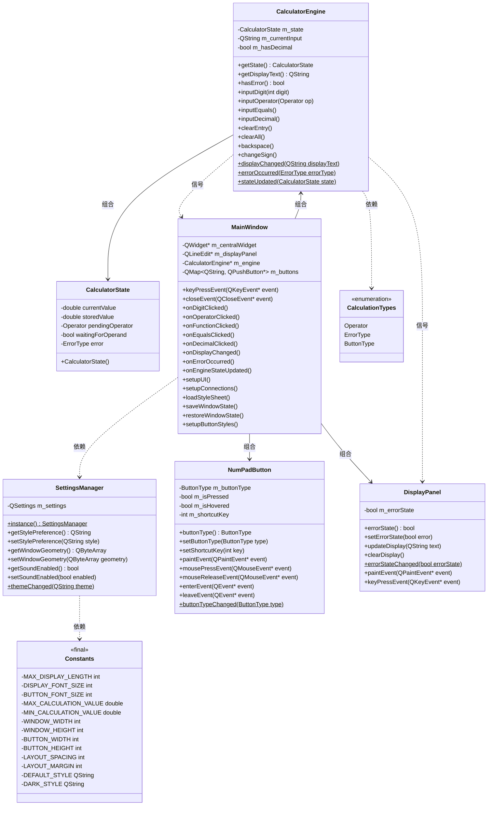

# Qt计算器项目完整技术文档

## 📖 文档概述

本文档为《基于Qt框架的简易计算器》项目的完整技术文档，旨在帮助新开发者快速理解项目架构、掌握代码结构，并能够顺利进行功能扩展和维护。

## 🏗️ 项目架构总览

### 系统架构图

```
┌────────────────────────────────────────────────────────────┐
│                       Application                          │
├────────────────────────────────────────────────────────────┤
│  ┌────────────┐  ┌──────────────┐  ┌────────────────────┐  │
│  │ MainWindow │  │ DisplayPanel │  │    Button Grid     │  │
│  └────────────┘  └──────────────┘  └────────────────────┘  │
├────────────────────────────────────────────────────────────┤
│                      Business Logic                        │
│  ┌─────────────────────────────────────────────────────┐   │
│  │                  CalculatorEngine                   │   │
│  │       运算逻辑 - 状态管理 - 错误处理 - 输入验证        │   │
│  └─────────────────────────────────────────────────────┘   │
├────────────────────────────────────────────────────────────┤
│                       Data Access                          │
│  ┌─────────────────────────────────────────────────────┐   │
│  │                  SettingsManager                    │   │
│  │      用户配置 - 窗口状态 - 样式偏好 - 持久化存储       │   │
│  └─────────────────────────────────────────────────────┘   │
├────────────────────────────────────────────────────────────┤
│                     Infrastructure                         │
│  ┌─────────────┐  ┌─────────────┐  ┌────────────────────┐  │
│  │  CalcTypes  │  │  Constants  │  │  Resource Manager  │  │
│  └─────────────┘  └─────────────┘  └────────────────────┘  │
└────────────────────────────────────────────────────────────┘
```

### 项目架构类图



## 📁 详细文件结构

### 源代码组织

```
Calculator/
│
├── inc/                            # 头文件目录
│   ├── core/
│   │   ├── CalculationTypes.h      # 定义计算相关类型（如操作符、状态等）
│   │   └── CalculatorEngine.h      # 计算逻辑核心类
│   ├── ui/  
│   │   ├── DisplayPanel.h          # 显示面板类
│   │   ├── MainWindow.h            # 主窗口类
│   │   └── NumPadButton.h          # 数字按钮类
│   └── utils/
│       ├── Constants.h             # 常量定义（如按钮文本、样式路径等）
│       └── SettingsManager.h       # 设置管理类（主题、配置等）
│
├── src/                    # 源文件目录
│   ├── core/
│   │   └── CalculatorEngine.cpp    # 计算逻辑实现
│   ├── ui/
│   │   ├── DisplayPanel.cpp        # 显示面板实现
│   │   ├── MainWindow.cpp          # 主窗口实现
│   │   └── NumPadButton.cpp        # 数字按钮实现
│   ├── utils/
│   │   ├── Constants.cpp           # 常量实现
│   │   └── SettingsManager.cpp     # 设置管理实现
│   └── main.cpp                    # 程序入口
│
├── styles/                         # 样式文件
│   ├── dark.qss                    # 深色主题样式
│   └── default.qss                 # 默认主题样式
│
├── Calculator.pro                  # Qt 项目文件
├── Calculator.pro.user             # Qt Creator 用户配置（可忽略）
└── Calculator.qrc                  # Qt 资源文件（图标、样式等）
```

## 📋 核心类详细说明

### 1. CalculatorEngine（计算引擎）

**职责**：核心计算逻辑和状态管理

| 方法                 | 参数            | 返回值              | 说明             |
| -------------------- | --------------- | ------------------- | ---------------- |
| `getState()`       | -               | `CalculatorState` | 获取当前状态     |
| `getDisplayText()` | -               | `QString`         | 获取显示文本     |
| `hasError()`       | -               | `bool`            | 检查错误状态     |
| `inputDigit()`     | `int digit`   | `void`            | 处理数字输入     |
| `inputOperator()`  | `Operator op` | `void`            | 处理运算符输入   |
| `inputEquals()`    | -               | `void`            | 执行等号运算     |
| `inputDecimal()`   | -               | `void`            | 处理小数点输入   |
| `clearEntry()`     | -               | `void`            | 清除当前输入(CE) |
| `clearAll()`       | -               | `void`            | 全部清除(C)      |
| `backspace()`      | -               | `void`            | 退格删除         |
| `changeSign()`     | -               | `void`            | 正负号切换       |

**关键状态变量**：

- `m_state`: 当前计算状态
- `m_currentInput`: 用户输入缓冲
- `m_hasDecimal`: 小数点标记

### 2. MainWindow（主窗口）

**职责**：用户界面管理和事件处理

| 方法                   | 说明             |
| ---------------------- | ---------------- |
| `setupUI()`          | 初始化界面布局   |
| `setupConnections()` | 建立信号槽连接   |
| `loadStyleSheet()`   | 加载样式主题     |
| `onXXXClicked()`系列 | 按钮点击事件处理 |
| `keyPressEvent()`    | 键盘事件处理     |
| `closeEvent()`       | 窗口关闭事件     |

**界面组件**：

- `m_centralWidget`: 中央窗口部件
- `m_displayPanel`: 计算结果显示面板
- `m_engine`: 计算器引擎
- `m_buttons`: 按钮映射表

### 3. SettingsManager（设置管理）

**职责**：应用程序配置持久化

| 方法                         | 说明         |
| ---------------------------- | ------------ |
| `instance()`               | 获取单例实例 |
| `get/setStylePreference()` | 样式偏好设置 |
| `get/setWindowGeometry()`  | 窗口状态设置 |
| `get/setSoundEnabled()`    | 声音设置     |
| `getAvailableThemes()`     | 可用主题列表 |
| `get/setLanguage()`        | 可用语言列表 |

**配置存储**：

- Windows: 系统注册表
- macOS: Property List文件
- Linux: ~/.config/ 目录

### 4. 数据类型定义

**Operator（运算符枚举）**：

```cpp
enum class Operator {
    None,       // 无操作
    Add,        // 加法 +
    Subtract,   // 减法 -
    Multiply,   // 乘法 ×  
    Divide,     // 除法 ÷
    Equals      // 等号 =
};
```

**ErrorType（错误类型枚举）**：

```cpp
enum class ErrorType {
    NoError,          // 无错误
    DivisionByZero,   // 除零错误
    Overflow,         // 溢出错误
    InvalidInput,     // 无效输入
    SyntaxError       // 语法错误
};
```

## 🔄 核心功能流程

### 1. 数字输入流程

```
用户点击数字按钮 
    → MainWindow::onDigitClicked()
    → CalculatorEngine::inputDigit()
    → 更新 m_currentInput
    → emit displayChanged()
    → MainWindow 更新显示
```

### 2. 运算执行流程

```
用户点击运算符
    → MainWindow::onOperatorClicked() 
    → CalculatorEngine::inputOperator()
    → 如有待处理运算则 calculate()
    → 保存运算符和当前值
    → 等待新操作数输入
```

### 3. 等号计算流程

```
用户点击等号
    → MainWindow::onEqualsClicked()
    → CalculatorEngine::inputEquals() 
    → calculate() 执行运算
    → 更新计算结果
    → emit displayChanged()
    → 重置运算符状态
```

### 4. 主题切换流程

```
用户切换主题
    → MainWindow::switchToTheme()
    → SettingsManager::setStylePreference()
    → emit themeChanged()
    → MainWindow::loadStyleSheet()
    → 重新加载QSS样式表
```

## 🎨 界面布局规范

### 按钮网格布局（5×4）

```
行0: [ CE ] [ C ] [⌫ ] [ ÷ ]
行1: [ 7 ]  [ 8 ] [ 9 ] [ × ]
行2: [ 4 ]  [ 5 ] [ 6 ] [ - ]
行3: [ 1 ]  [ 2 ] [ 3 ] [ + ]
行4: [     0    ] [ . ] [ = ]
```

### 样式分类

| 按钮类型 | 样式类       | 默认颜色 | 功能           |
| -------- | ------------ | -------- | -------------- |
| 数字按钮 | `number`   | #f8f9fa  | 0-9数字输入    |
| 运算符   | `operator` | #007bff  | + - × ÷ 运算 |
| 等号     | `equals`   | #28a745  | 执行计算       |
| 功能按钮 | `function` | #6c757d  | CE C ⌫ 功能   |

## ⌨️ 键盘快捷键映射

| 按键                         | 功能     | 对应按钮  |
| ---------------------------- | -------- | --------- |
| `0-9`                      | 数字输入 | 数字按钮  |
| `+ - * /`                  | 运算符   | + - × ÷ |
| `Enter`, `Return`, `=` | 等号     | =         |
| `.`                        | 小数点   | .         |
| `Backspace`                | 退格     | ⌫        |
| `Escape`                   | 全部清除 | C         |

## 🛠️ 开发扩展指南

### 添加新运算符（以平方根为例）

**步骤1：扩展枚举**

```cpp
// calculationtypes.h
enum class Operator {
    // ... 现有运算符
    SquareRoot  // 新增平方根
};
```

**步骤2：实现运算逻辑**

```cpp
// calculatorengine.cpp
void CalculatorEngine::inputOperator(Operator op) {
    case Operator::SquareRoot:
        if (m_state.currentValue >= 0) {
            m_state.currentValue = sqrt(m_state.currentValue);
        } else {
            setError(ErrorType::InvalidInput);
        }
        break;
}
```

**步骤3：添加界面支持**

```cpp
// mainwindow.cpp - setupUI()
m_buttons["sqrt"] = new QPushButton("√");

// mainwindow.cpp - setupConnections()  
connect(m_buttons["sqrt"], &QPushButton::clicked,
        [this](){ m_engine->inputOperator(Operator::SquareRoot); });
```

### 添加计算历史功能

**步骤1：创建历史记录类**

```cpp
class CalculationHistory {
private:
    QList<QPair<QString, double>> m_history;
public:
    void addEntry(const QString& expression, double result);
    QList<QString> getHistory() const;
};
```

**步骤2：集成到主窗口**

```cpp
// mainwindow.h
class MainWindow {
private:
    CalculationHistory* m_history;
    QListWidget* m_historyList;
};
```

## 📊 性能和安全考虑

### 性能优化

- **输入验证**: 所有数字输入都经过范围检查
- **内存管理**: 使用Qt父子对象机制自动释放内存
- **信号优化**: 避免不必要的信号发射

### 错误处理

- **除零检查**: 除法运算前检查除数
- **溢出检测**: 检查计算结果是否超出范围
- **输入验证**: 防止无效字符输入

### 用户体验

- **即时反馈**: 所有操作都有视觉反馈
- **状态持久化**: 记住用户偏好设置
- **键盘支持**: 完整的快捷键支持

---

这份文档提供了项目的完整技术视图，可以作为新开发者快速上手的参考资料，也便于后续的功能扩展和维护工作。
